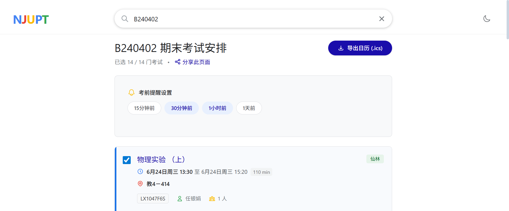

# 📅 NJUPT Exam Sync (南邮考试日程助手)

<div align="center">


### ✨ 为南邮学子打造的极简考试日程同步工具

[**在线使用**](https://njupt.hicancan.top) · [报告 Bug](https://github.com/hicancan/njupt-exam/issues) · [请求功能](https://github.com/hicancan/njupt-exam/issues)


</div>

---

## 📖 项目简介 (Introduction)

**NJUPT Exam Sync** 是一个轻量级、无需登录的纯前端工具，旨在解决教务处 Excel 考表查询繁琐、难以保存的问题。

只需输入班级号，即可快速筛选出你的期末考试安排。不仅支持**模糊搜索**，还支持**自主勾选**需要参加的考试（完美解决重修/免修的个性化需求），并一键导出 `.ics` 日历文件。

导出的日历完美适配 iOS/Android/鸿蒙/Outlook/Google Calendar 等主流系统日历，彻底告别"看错行"和"记错时间"。

## ✨ 核心亮点 (Features)

- ⚡ **极速体验**：基于 React 19 + TypeScript 5.9 + Vite 7 构建，秒开无白屏。
- 🛡️ **类型安全**：全项目采用 TypeScript 开发，严格模式 + noUncheckedIndexedAccess，代码健壮。
- 🎨 **极简美学**：采用经典 Google 搜索风格的极简 UI，沉浸式搜索，高度克制的设计让信息呈现极其高效。
- 📱 **极致适配**：完美适配各尺寸移动设备，响应式排版像素级调优，移动端体验媲美原生 App。
- 🌗 **深色模式**：自动跟随系统切换深色模式，支持手动切换，深夜查分不刺眼。
- 🔍 **智能搜索**：输入班级号（支持模糊匹配）自动联想，毫秒级响应。
- 📅 **按需导出**：支持**手动勾选/反选**考试科目，一键生成标准 iCalendar (.ics) 文件，包含**时区修正**。
- 🔗 **社交分享**：支持生成带有班级参数的链接（如 `?class=B250403`），复制发给同学，点开即看。
- 📱 **PWA 支持**：支持"添加到主屏幕"，可离线访问，像原生 App 一样全屏运行。
- 🔔 **定制提醒**：内置考前 15 分钟、30 分钟、1 小时、1 天等多重提醒选项，绝不缺考。
- 🔄 **自动同步**：GitHub Actions 每 6 小时自动爬取教务处最新考表，数据持续更新。
- 🛡️ **隐私安全**：纯静态站点，无后台数据库，所有查询逻辑在浏览器本地完成。

## 📸 预览 (Screenshots)

<div align="center">

| **桌面端搜索页** | **移动端详情页** |
|:---:|:---:|
|  |  |
| *适配 Tailwind v4 的简约设计* | *支持 PWA 离线访问与日历导出* |

</div>

## 🚀 快速开始 (Getting Started)

### 🌐 在线使用

直接访问部署好的地址（推荐）：**[https://njupt.hicancan.top](https://njupt.hicancan.top)**

### 💻 本地开发运行 (对于开发者)

> **注意**：本项目使用最新的 **React 19** 和 **Tailwind CSS v4**。请确保你的 Node.js 版本 >= 20。

1. **克隆仓库**

    ```bash
    git clone https://github.com/hicancan/njupt-exam.git
    cd njupt-exam
    ```

2. **安装依赖**

    ```bash
    npm install
    ```

3. **启动开发服务器**

    ```bash
    npm run dev
    # 然后浏览器访问 http://localhost:5173
    ```

4. **构建生产版本**

    ```bash
    npm run build
    # 构建产物位于 dist/ 目录
    ```

### 🧪 代码质量检查

```bash
# TypeScript 类型检查
npm run typecheck

# ESLint 代码检查
npm run lint
```

## 🛠️ 技术栈 (Tech Stack)

| 类别 | 技术 |
|------|------|
| 前端框架 | React 19 |
| 类型系统 | TypeScript 5.9 |
| 构建工具 | Vite 7 |
| 样式框架 | Tailwind CSS v4 |
| 图标库 | Heroicons |
| PWA | vite-plugin-pwa + Workbox |
| 数据处理 | Python 3 + Pandas + Pydantic |
| CI/CD | GitHub Actions |
| 部署 | GitHub Pages |

## 📂 项目结构 (Project Structure)

```text
NJUPT-Exam/
├── .github/workflows/         # 🔄 CI/CD 工作流
│   ├── auto-update.yml        # 自动爬取教务数据 (每6小时)
│   └── deploy.yml             # 自动构建部署 GitHub Pages
├── public/                    # 🌐 公共静态资源
│   ├── data/                  # 🗄️ 数据产物 (自动生成)
│   │   ├── all_exams.json     # 考试数据 (核心)
│   │   ├── data_summary.json  # 数据摘要 (元数据)
│   │   ├── source_metadata.json # 数据来源信息
│   │   └── DATA_INVENTORY.md  # 数据质量报告
│   └── assets/                # 🖼️ 图标与示例图片
├── src/                       # ⚛️ 源代码 (TypeScript)
│   ├── components/            # 🧩 UI 组件
│   │   ├── ExamCard.tsx       # 考试卡片 (含无障碍支持)
│   │   ├── ExamDetail.tsx     # 考试详情页 + ICS 导出
│   │   ├── ExamList.tsx       # 班级列表
│   │   ├── ReminderSettings.tsx # 提醒设置
│   │   ├── SearchInput.tsx    # 搜索输入框
│   │   ├── ThemeToggle.tsx    # 深色模式切换
│   │   └── UptimeDisplay.tsx  # 运行状态显示
│   ├── hooks/                 # 🪝 自定义 Hooks
│   │   └── useExamData.ts     # 数据获取与管理
│   ├── types/                 # 🏷️ TypeScript 类型定义
│   │   └── index.ts           # Exam, Manifest 等接口
│   ├── utils/                 # 🛠️ 工具函数
│   │   └── icsGenerator.ts    # ICS 日历生成 (含时区支持)
│   ├── constants.ts           # ⚙️ 应用常量配置
│   ├── App.tsx                # 📱 主应用逻辑
│   ├── main.tsx               # ⚡ 入口文件
│   └── index.css              # 🎨 全局样式 (Tailwind v4)
├── scripts/                   # 🐍 Python 工具脚本
│   ├── auto_update_exam_data.py # 教务网爬虫
│   ├── analyze_and_update.py  # Excel 解析 + 数据校验
│   └── run_locally.bat        # Windows 一键启动
├── package.json               # 📦 依赖管理
├── vite.config.ts             # ⚡ Vite 配置 (含 PWA)
├── tsconfig.json              # 📐 TypeScript 配置
└── README.md                  # 📄 项目说明文档
```

## 🔄 数据更新机制 (Data Pipeline)

项目采用 **全自动化数据同步** 机制：


### 手动更新数据

当教务处发布新的 Excel 考表时，管理员也可手动执行以下步骤：

1. 安装 Python 依赖（仅首次需要）：

   ```bash
   pip install -r requirements.txt
   ```

2. 运行爬虫下载最新数据：

   ```bash
   python scripts/auto_update_exam_data.py
   ```

3. 处理 Excel 生成 JSON：

   ```bash
   python scripts/analyze_and_update.py
   ```

4. 提交更改到 GitHub，GitHub Actions 会自动构建并部署更新。

## 🔒 数据校验 (Data Validation)

本项目使用 **Pydantic** 进行严格的数据校验：

- ✅ 自动清洗空白字符和特殊字符
- ✅ 识别并解析多种时间格式（中文日期、ISO 日期）
- ✅ 保留解析失败的记录并标记 `parse_error`
- ✅ 生成 `DATA_INVENTORY.md` 数据质量报告

## ♿ 无障碍支持 (Accessibility)

- 所有交互元素包含 `role`、`aria-*` 属性
- 支持键盘导航 (Tab + Enter/Space)
- 隐藏标签使用 `sr-only` 类
- 动画尊重 `prefers-reduced-motion` 用户偏好

## 🤝 贡献 (Contributing)

欢迎提交 Issue 或 Pull Request！

如果你发现了新的考表格式导致解析失败，请提交 Issue 并附上脱敏后的 Excel 样本的一两行数据。

## ⚠️ 免责声明 (Disclaimer)

- 本工具数据来源于教务处发布的 Excel 汇总表，经程序自动处理生成。
- 虽然我们使用了 Pydantic 进行严格的数据校验，但**无法保证 100% 无误**。
- **最终考试时间、地点请务必以学校教务系统及准考证为准！**
- 开发者不对因依赖本工具而导致的任何考试延误或缺考承担责任。

## 📄 开源协议 (License)

本项目遵循 [MIT License](LICENSE) 开源协议。

------

<div align="center">

Made with ❤️ by <a href="https://hicancan.top">hicancan</a>

**如果这个项目对你有帮助，欢迎给个 ⭐ Star！**

</div>
