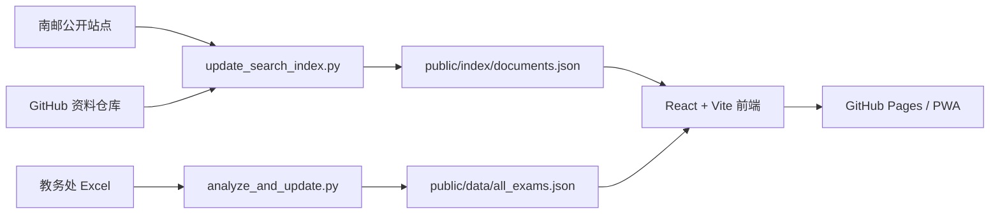

# njupt-search

<div align="center">


**南邮学生的信息入口：搜公告、搜考试、搜竞赛、搜讲座、搜项目、搜资料。**

[在线使用](https://njupt.hicancan.top) · [报告 Bug](https://github.com/hicancan/njupt-search/issues) · [路线图](docs/njupt-search-product-roadmap.md)


</div>

---

## 项目定位

`njupt-search` 致力于将分散在南邮各个公开站点里的学生相关信息，整合为一个可搜索、可过滤、可持续更新的极速校园信息入口。

当前版本内置了独立的考试垂直频道：输入班级号即可查看期末考试安排、手动勾选课程并导出 `.ics` 日历。除此之外，全局搜索结果深度接入了全校公开公告、就业宣讲会、图书馆/后勤/保卫处通知以及开源 GitHub 资料仓库。

## 已接入数据

当前收录 10 个校园公开源：

| 源 | 域名 | 主要内容 |
| --- | --- | --- |
| 本科生院 / 教务处 | `jwc.njupt.edu.cn` | 考试、选课、转专业、推免、课程通知 |
| 学生工作处 | `xsc.njupt.edu.cn` | 奖助、公示、宿舍、学生手册、心理健康 |
| 研究生院 | `pg.njupt.edu.cn` | 培养、学位、答辩、研究生竞赛 |
| 研究生工作部 | `ygb.njupt.edu.cn` | 研究生奖助、评优、实践、学术活动 |
| 团委 / 青春南邮 | `youth.njupt.edu.cn` | 社团、挑战杯、志愿服务、活动 |
| 创新创业教育学院 | `cxcy.njupt.edu.cn` | 科创竞赛、大创项目、创业基金 |
| 就业信息网 | `njupt.91job.org.cn` | 招聘会、宣讲会 |
| 图书馆 | `lib.njupt.edu.cn` | 开放安排、数据库、阅读活动 |
| 保卫处 | `bwc.njupt.edu.cn` | 交通、安全、消防、车贴、户籍 |
| 后勤管理处 | `hqc.njupt.edu.cn` | 停水停电、维修、医保、班车 |

索引产物位于：

```text
public/index/documents.json
public/index/manifest.json
```

GitHub 资料源配置位于：

```text
config/github_search_sources.json
```

考试数据仍位于：

```text
public/data/all_exams.json
public/data/data_summary.json
```

## 核心能力

- 统一搜索：公告、考试记录、就业宣讲、项目文档和学习资源进入同一排序模型。
- 分类频道：考试 / 竞赛 / 奖助 / 就业 / 讲座 / 生活 / 学院 / 研究生 / 项目 / 资料。
- 默认过滤：入库时过滤低学生相关内容，结果页按相关度和发布时间展示。
- 考试垂直频道：班级号搜索、模糊班级选择、手动勾选考试、导出标准 iCalendar。
- 自动更新：GitHub Actions 每 6 小时更新考试数据、校园搜索索引和已配置 GitHub 资料源。
- PWA / Android TWA：支持添加到主屏幕，缓存 `/data/` 和 `/index/` 数据并监听后台更新。

## 本地开发

> 需要 Node.js >= 20。Windows 环境建议使用 PowerShell 7。

```powershell
npm install
npm run dev
```

生产构建：

```powershell
npm run build
```

质量检查：

```powershell
npm run typecheck
npm run lint
npm test
```

## 数据更新

安装 Python 依赖：

```powershell
uv pip install -r requirements.txt
```

更新考试 Excel 与结构化考试数据：

```powershell
uv run python scripts\auto_update_exam_data.py
uv run python scripts\analyze_and_update.py
```

更新校园搜索索引：

```powershell
uv run python scripts\update_search_index.py
```

CI 中如需读取 GitHub 资料仓库，请配置仓库级 Actions secret：

```powershell
gh auth token | gh secret set NJUPT_SEARCH_GITHUB_TOKEN --repo hicancan/njupt-search
```

数据流水线：



## 项目结构

```text
njupt-search/
├── docs/
│   └── njupt-search-product-roadmap.md
├── config/
│   └── github_search_sources.json
├── public/
│   ├── data/                  # 考试垂直频道数据
│   ├── index/                 # 校园搜索索引
│   └── assets/
├── scripts/
│   ├── auto_update_exam_data.py
│   ├── analyze_and_update.py
│   └── update_search_index.py
├── src/
│   ├── components/
│   ├── hooks/
│   ├── types/
│   └── utils/
└── .github/workflows/
    ├── auto-update.yml
    ├── deploy.yml
    └── build-apk.yml
```

## 免责声明

- 只抓取公开网页与公开接口，不接入需要登录的系统。
- 考试信息由教务处公开 Excel 自动解析生成，最终时间地点请以学校教务系统及准考证为准。
- 公告索引依赖各站点公开页面可用性，若源站短暂异常，`manifest.json` 会记录源级状态。

## License

[MIT](LICENSE)
