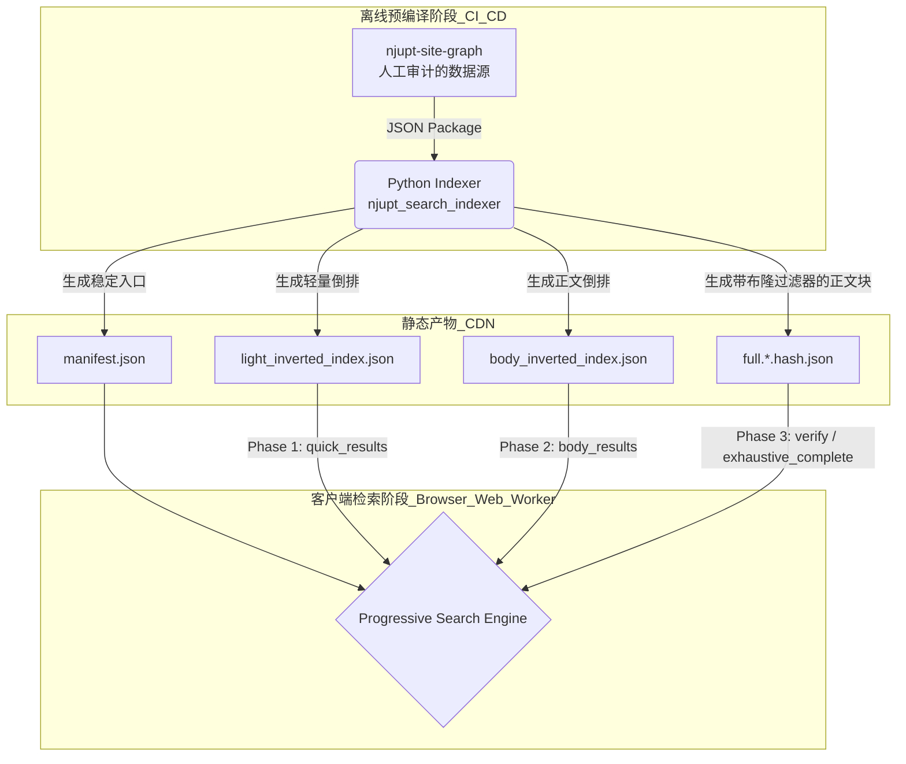

<div align="center">

# 🔍 njupt-search

**Progressive Verifiable Static Search**

[](LICENSE)
[](https://www.typescriptlang.org/)
[](https://react.dev/)
[](https://www.python.org/)

南邮本科生教务信息与考试查询的 Serverless 静态搜索引擎。<br>
通过预编译倒排索引与 Bloom Filter 分片，将全量搜索算力安全下放至浏览器 Web Worker，实现 **0 成本**的纯静态全文检索体验。

🌍 **[在线体验 (njupt.hicancan.top)](https://njupt.hicancan.top)**

</div>

---

## 💡 核心机制与架构 (Architecture)

本项目不依赖任何服务端数据库（如 MySQL/ElasticSearch），而是通过 Python 工具链将爬取的源数据（Source Package）预先编译为哈希分片，交由前端渐进式消费。

### Progressive Search (渐进式静态检索)

前端 UI 触发搜索后，Web Worker 将执行多阶段流水线：
1. **Light Index (轻量索引)**：首先拉取极小的 `light_inverted_index.json`，瞬间返回匹配标题的结果。
2. **Body Index (摘要补全)**：后台静默拉取 `body_inverted_index.json`，获取文本摘要命中。
3. **Full Shard Scan (分片扫表)**：利用分片自带的 **Bloom Filter (布隆过滤器)** 提前跳过无命中的数据块，仅下载和扫描包含关键词的完整分片（Full Shards），最终达成 `exhaustive_complete`（穷尽完整结果）。



## 📦 项目目录结构 (Monorepo)

本项目采用 NPM Workspaces + Python `uv` 混合 Monorepo 管理：

```text
njupt-search/
├── apps/web/               # React 19 / Vite / Tailwind 纯前端应用与 Web Worker
├── packages/               # TypeScript 公共逻辑库
│   ├── contracts/          # 静态资源的 Schema 与接口契约
│   ├── exam-core/          # 考试日历、结构解析核心逻辑
│   └── search-core/        # 浏览器端 Progressive Search 执行引擎
├── tools/                  # Python 离线数据管道 (uv 管理)
│   ├── collection-indexer/ # 核心：将源数据编译为倒排索引与过滤分片
│   ├── exam-pipeline/      # 考试数据处理流水线
│   ├── quality-gates/      # 索引体积与 Schema 结构校验
│   └── search-eval/        # 搜索结果质量回归评测
├── android/                # 基于 Trusted Web Activity (TWA) 的安卓客户端包装
└── tests/                  # 核心逻辑单元测试
```

## 🚀 本地开发指南

### 1. 启动前端 UI

确保本地已安装 Node.js (>=20) 并启用 NPM Workspaces。

```powershell
npm ci
npm run dev
```

### 2. 完整的数据构建与校验流程

本项目使用 `uv` 管理 Python 依赖 (`pyproject.toml` + `uv.lock`)。进行完整的数据校验与构建，需在根目录执行以下 PowerShell 指令：

```powershell
# 1. 验证上游数据源
uv run python -m njupt_search_indexer validate `
  --source-package D:\code\github\hicancan\njupt-site-graph\data\sites\jwc\index `
  --source-package D:\code\github\hicancan\njupt-site-graph\data\sites\xsc\index `
  --source-package D:\code\github\hicancan\njupt-site-graph\data\sites\cxcy\index `
  --skip-output

# 2. 编译并生成前端静态索引 (Collection)
uv run python -m njupt_search_indexer build --collection-id njupt-public `
  --source-package D:\code\github\hicancan\njupt-site-graph\data\sites\jwc\index `
  --source-package D:\code\github\hicancan\njupt-site-graph\data\sites\xsc\index `
  --source-package D:\code\github\hicancan\njupt-site-graph\data\sites\cxcy\index `
  --out apps\web\public\generated\collections\njupt-public

# 3. 验证生成的产物契约
uv run python -m njupt_search_indexer validate `
  --source-package D:\code\github\hicancan\njupt-site-graph\data\sites\jwc\index `
  --source-package D:\code\github\hicancan\njupt-site-graph\data\sites\xsc\index `
  --source-package D:\code\github\hicancan\njupt-site-graph\data\sites\cxcy\index `
  --collection apps\web\public\generated\collections\njupt-public

# 4. 质量门禁检查 (索引体积与结构规范)
uv run python tools\quality-gates\scripts\validate_search_index.py
uv run python tools\quality-gates\scripts\check_public_artifact_sizes.py

# 5. 冒烟测试与评估 (Smoke Queries)
uv run python -m njupt_search_eval run-smoke-queries --collection apps\web\public\generated\collections\njupt-public
```

> **代表性评测词 (Smoke Queries)：**
> 校历、慕课考试、期末考试、转专业、规章制度、办事流程、学生相关文件及表格、教务管理系统、大创、推免、成绩、附件1、xlsx、奖学金、辅导员、双创、互联网+。

### 3. 代码质量与格式化

```powershell
uv run python -m pytest   # Python 单元测试
npm test                  # TS/JS 单元测试 (Vitest)
npm run typecheck         # TS 类型检查
npm run lint              # ESLint 代码规范
npm run build             # 前端生产环境构建
```

## 🤖 自动化工作流 (CI/CD)

通过 GitHub Actions 实现了完全无人值守的数据流转：
- `.github/workflows/update-exam-data.yml`: 定期抓取与更新静态考试 JSON。
- `.github/workflows/update-collection-index.yml`: 消费 `njupt-site-graph` 产物并执行 Python Indexer 构建。
- `.github/workflows/validate-generated-artifacts.yml`: 执行 Quality Gates 与契约校验。
- `.github/workflows/deploy-web.yml`: 将编译好的前后端静态资源发布至 GitHub Pages。

## 📄 License

[AGPL-3.0 License](LICENSE)
